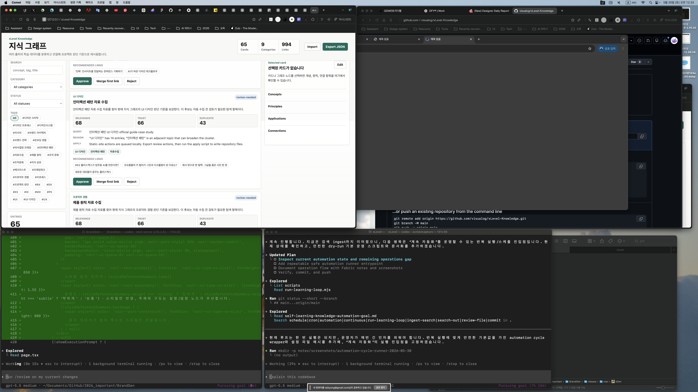
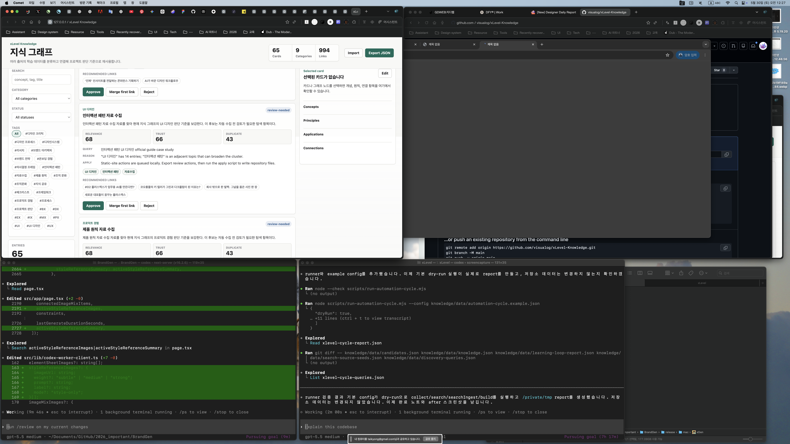

# Completion Report: Automation Cycle Runner

Date: 2026-05-30
Task: Add a safe repeatable runner for the self-learning automation loop.

## Summary

Added `scripts/run-automation-cycle.mjs` and `knowledge/data/automation-cycle.example.json` as a stable operational entrypoint for repeated self-learning checks.

The example cycle is dry-run by default. It runs the search-backed learning loop, writes temporary query/source/report outputs, rebuilds the index, and does not approve or persist discovered knowledge.

## Changes

- Added `scripts/run-automation-cycle.mjs`.
- Added `knowledge/data/automation-cycle.example.json`.
- Updated goal documents with the safe repeatable runner command.
- The runner supports:
  - `--config <path>`
  - `--dry-run`
  - `--write`
  - `--report-out <path>`

## Before And After

### Before



### After



## Verification

Commands run:

```bash
node --check scripts/run-automation-cycle.mjs
node scripts/run-automation-cycle.mjs --config knowledge/data/automation-cycle.example.json
```

Observed behavior:

- The example config ran with `dryRun: true`.
- The runner executed collect, search, searchIngest, and build steps.
- It reported five generated candidates, one search source, and five search-ingest candidates.
- It wrote `/private/tmp/xlevel-cycle-report.json`.
- It did not mutate `knowledge/data/candidates.json`, `knowledge/data/knowledge.json`, `knowledge/data/learning-loop-report.json`, `knowledge/data/search-source-seeds.json`, or `knowledge/data/discovery-queries.json`.

## Known Limits

- This provides a repeatable runner but not an installed OS-level scheduler.
- `--write` should be used only when an operator intentionally wants configured outputs written.
- Git commit and push remain explicit operator actions.
