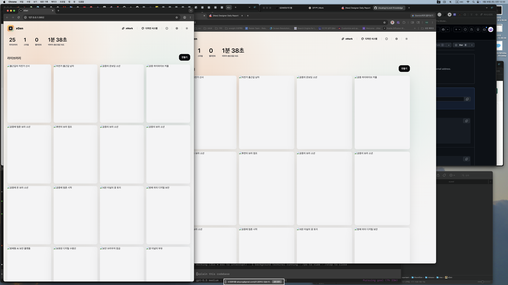
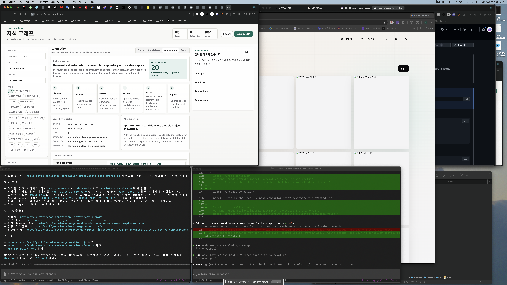

# Automation Status UI Completion Report

Date: 2026-05-30

## Summary

Added an Automation view to the local knowledge site so the self-learning loop is visible from the UI instead of only existing as scripts.

## Changes

- Added an `Automation` segmented tab in `knowledge/site/index.html`.
- Added a dedicated automation panel that loads `knowledge/data/automation-cycle.example.json`.
- Rendered the review-first automation flow: discover, expand, ingest, review, apply, repeat.
- Documented what candidate `Approve` does in static export mode and write-bridge mode.
- Listed operator commands for safe cycle runs, search ingest, review apply, write bridge, and launchd scheduler preview/status/install/uninstall.

## Verification

- `node --check knowledge/site/app.js`
- Served the site locally on port `8092`.
- Verified `knowledge/data/automation-cycle.example.json` loads over the local server.
- Opened `http://localhost:8092/knowledge/site/#automation` and captured the after screenshot.

## Screenshots

Before:

After:

