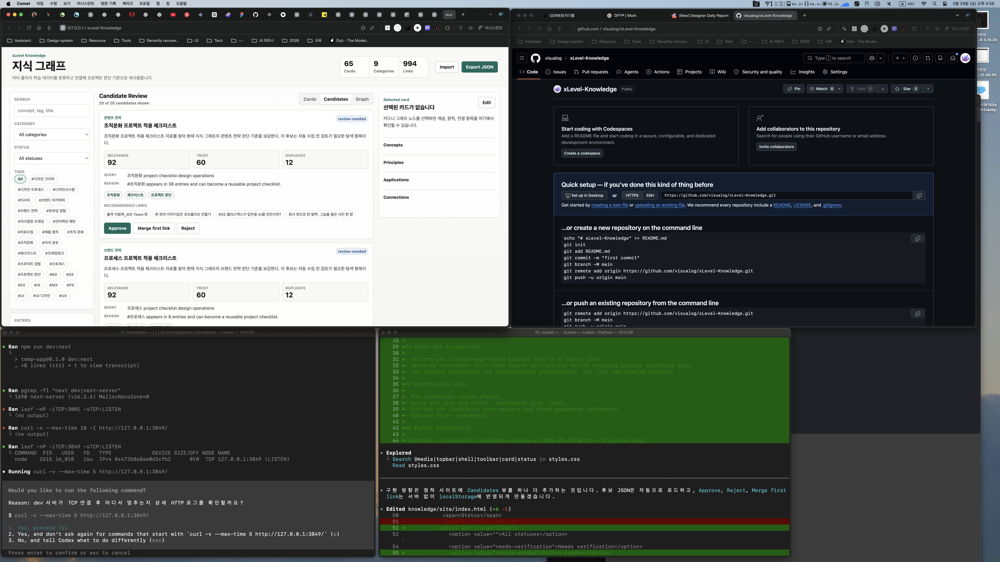

# Completion Report: Candidate Review UI

Date: 2026-05-29
Task: Make generated knowledge collection candidates visible and reviewable in the static site.

## Summary

Added a `Candidates` view to the knowledge site. The site now loads `knowledge/data/candidates.json`, shows generated collection opportunities, and supports local review actions.

## Changes

- Added `Candidates` to the Cards/Graph segmented control.
- Added a candidate count to the sidebar stats.
- Added candidate cards with category, status, summary, relevance/trust/duplicate scores, generated query, reason, tags, and recommended links.
- Added local review actions:
  - `Approve`: adds the candidate to knowledge entries as `needs-verification`.
  - `Reject`: removes the candidate from the local review queue.
  - `Merge first link`: merges candidate fields into the first recommended existing card.
- Added `#candidates` route support.

## Before And After

### Before

### After

## Verification

- `node --check knowledge/site/app.js`
- Opened `http://127.0.0.1:8080/knowledge/site/?v=candidate-after#candidates`
- Confirmed the Candidates tab renders 20 generated candidates in the browser screenshot.

## Known Limits

- Review actions are localStorage-based because the site is static.
- Approved candidates are still review-first placeholders and should be source-verified before committing as durable knowledge.
