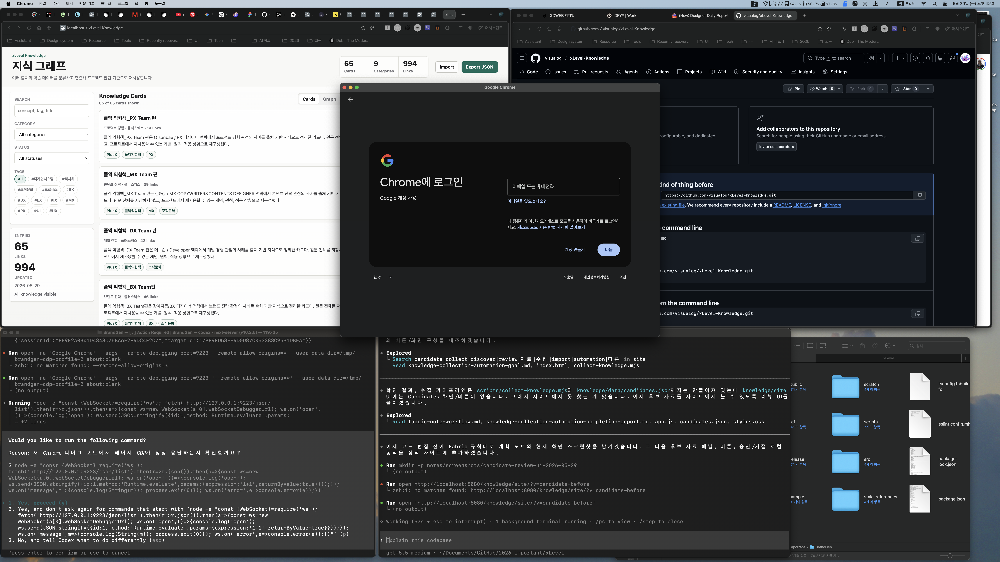

# Plan: Candidate Review UI

Date: 2026-05-29
Task: Make the generated knowledge collection candidates visible and reviewable in the static site.

## Objective

Expose `knowledge/data/candidates.json` inside the site so generated source opportunities are discoverable without running scripts or opening JSON files.

## Current State

The collection script and candidate data exist, but the site only renders knowledge cards and graph views. The completion report explicitly listed candidate review UI as follow-up work.

## Plan

1. Load bundled candidates from `../data/candidates.json`, with localStorage fallback for reviewed state.
2. Add a Candidates view to the main segmented control and show candidate count.
3. Render candidate cards with relevance, trust, duplicate scores, generated search query, reason, and recommended connections.
4. Add local Approve and Reject actions. Approve will add the candidate to knowledge entries and remove it from the candidate queue; Reject will remove it from the queue locally.
5. Keep the implementation static and compatible with the existing import/export localStorage model.

## Expected Change Areas

- `knowledge/site/index.html`
- `knowledge/site/app.js`
- `knowledge/site/styles.css`
- `notes/candidate-review-ui-completion-report.md`

## Risks And Assumptions

- Actions are localStorage-based because this is a static site.
- Approved candidates still need source verification before becoming durable committed data.
- The current candidates are deterministic placeholders, not live web-crawled sources.

## Verification Plan

- Run JavaScript syntax checks.
- Serve the site and verify `candidates.json` loads.
- Confirm the Candidates view appears and shows generated candidates.
- Capture after screenshot.

## Before Screenshots

