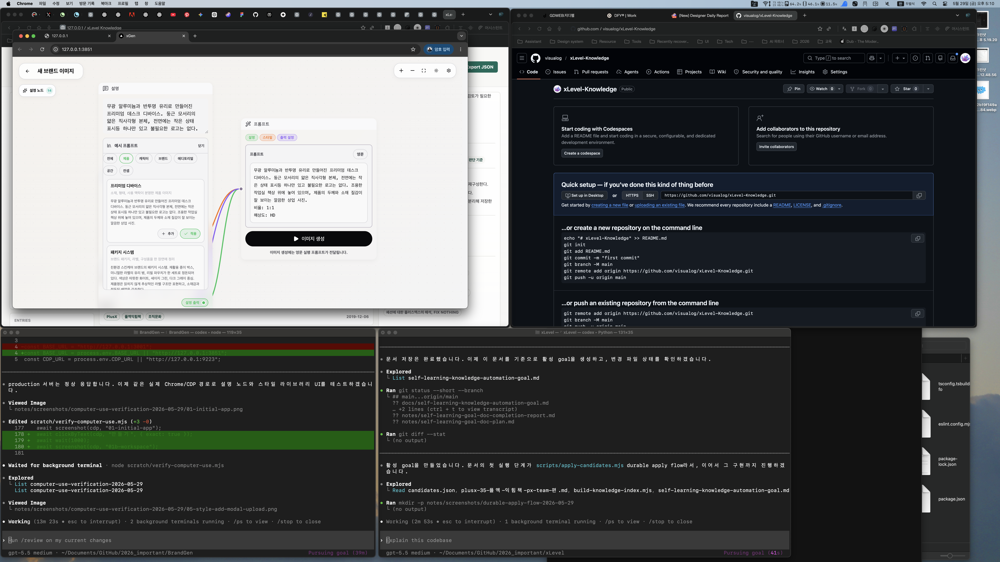
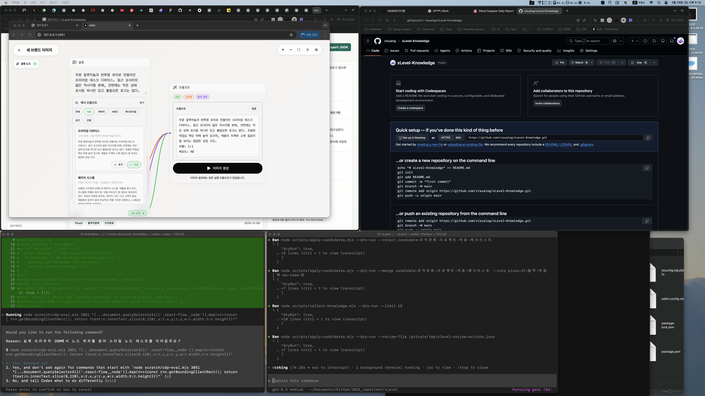

# Completion Report: Durable Apply Flow

Date: 2026-05-29
Task: Implement Phase 1 of `docs/self-learning-knowledge-automation-goal.md`.

## Summary

Added a repository-writing candidate apply script. Reviewed candidates can now be dry-run or applied as durable Markdown entries, rejected into a review history file, or merged into existing entries.

## Changes

- Created `scripts/apply-candidates.mjs`.
- Extended `scripts/build-knowledge-index.mjs` to scan every `knowledge/*/entries/` directory instead of only `knowledge/plusx-flex/entries/`.
- Updated index rebuild behavior to preserve existing normalized metadata and existing entry order.
- Added dry-run support for approve, reject, merge, and review-file workflows.

## Before And After

### Before



### After



## Verification

Commands run:

```bash
node --check scripts/apply-candidates.mjs
node --check scripts/build-knowledge-index.mjs
node --check scripts/collect-knowledge.mjs
node --check knowledge/site/app.js
node scripts/apply-candidates.mjs --dry-run --approve candidate-조직문화-프로젝트-적용-체크리스트
node scripts/apply-candidates.mjs --dry-run --reject candidate-조직문화-프로젝트-적용-체크리스트
node scripts/apply-candidates.mjs --dry-run --merge candidate-조직문화-프로젝트-적용-체크리스트 --into plusx-37-플엑-익힘책-mx-team-편
node scripts/apply-candidates.mjs --dry-run --review-file /private/tmp/xlevel-review-actions.json
node scripts/collect-knowledge.mjs --dry-run --limit 10
node scripts/build-knowledge-index.mjs
```

Results:

- Syntax checks passed.
- Apply dry-runs returned expected approve, reject, merge, and review-file action summaries.
- Candidate generation dry-run returned 10 linked candidates.
- Rebuilding the index after the build-script update produced no `knowledge/data/knowledge.json` diff.

## Known Limits

- Real apply commands were not run against current candidates to avoid mutating review data during verification.
- Site actions still use localStorage; the next phase should export review actions or call a local write bridge.
