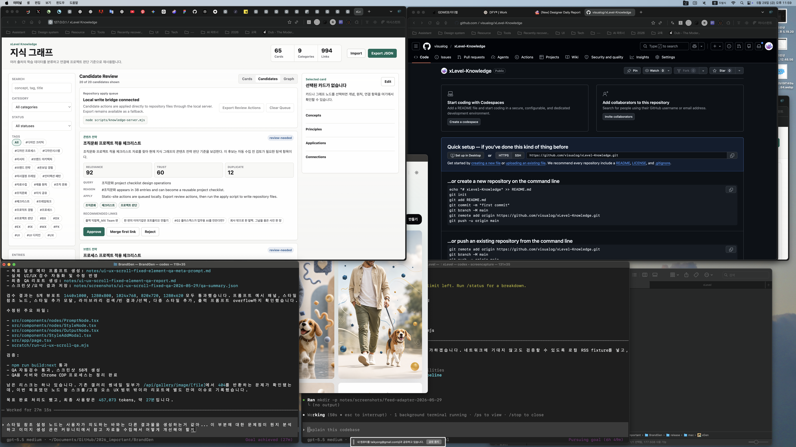
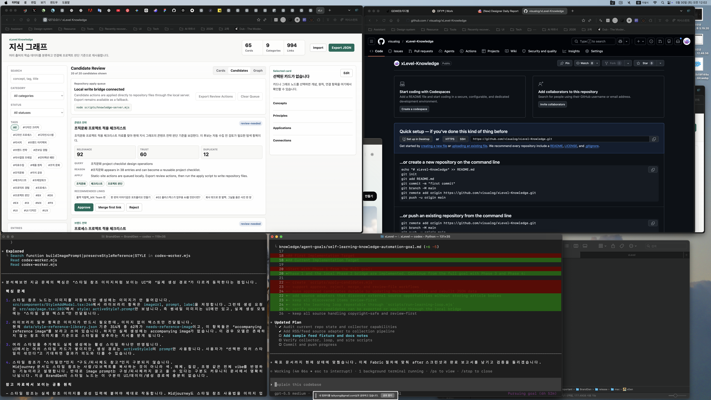

# Completion Report: RSS Feed Adapter

Date: 2026-05-29

## Summary

Added RSS/Atom feed metadata ingestion to the review-first learning pipeline.

The collector now accepts `--feed-file <path-or-url>`, parses feed item metadata, converts each item into a review-needed candidate, links candidates to existing knowledge entries, and keeps generated output source-linked without storing article bodies.

## Changes

- Added `--feed-file` support to `scripts/collect-knowledge.mjs`.
- Added dependency-free RSS and Atom metadata parsing.
- Added feed candidate categorization and duplicate scoring.
- Passed `--feed-file` through `scripts/run-learning-loop.mjs`.
- Added `knowledge/data/feed-seeds.example.xml` for deterministic local verification.
- Updated the goal documents to distinguish implemented apply/bridge/adapters from remaining live discovery work.

## Verification

Commands run:

```bash
node --check scripts/collect-knowledge.mjs
node --check scripts/run-learning-loop.mjs
node --check scripts/apply-candidates.mjs
node --check scripts/knowledge-server.mjs
node --check knowledge/site/app.js
node scripts/collect-knowledge.mjs --dry-run --feed-file knowledge/data/feed-seeds.example.xml --limit 5
node scripts/run-learning-loop.mjs --dry-run --feed-file knowledge/data/feed-seeds.example.xml --limit 5
```

Expected behavior was confirmed:

- Feed fixture produced review candidates.
- Learning loop accepted the same feed input.
- Dry-run commands did not mutate `knowledge/data/candidates.json` or `knowledge/data/knowledge.json`.

## Remaining Work

- Add live search or browser-backed discovery.
- Add production-grade source fetching and extraction for allowed metadata.
- Add scheduling or external runner integration for continuous execution.
- Keep review approval as a human-gated step.

## Screenshots

Before:



After:


