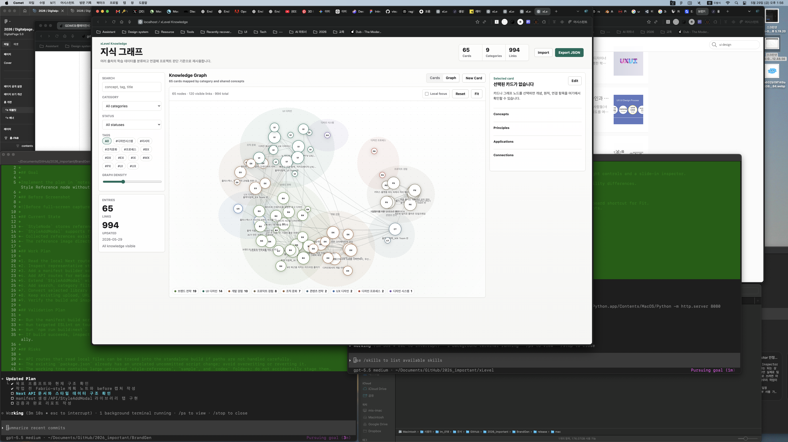
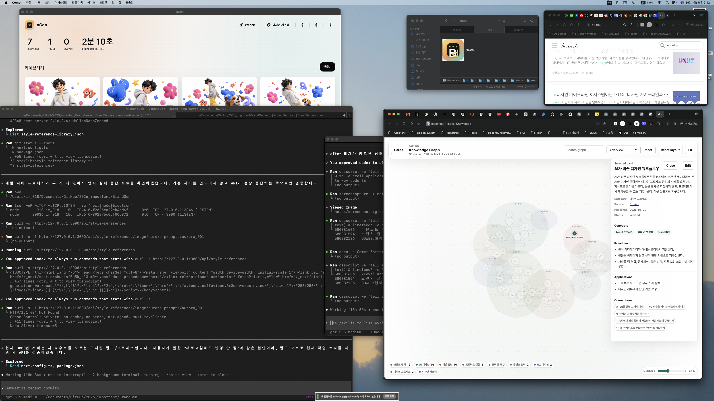

# Graph Canvas Mode Completion Report

Date: 2026-05-29

## Summary

Graph view is now a canvas-first exploration mode. Cards view remains the management/list surface, while Graph view hides the standard sidebar/editor layout and presents a full-window graph canvas with floating controls, view modes, draggable nodes, persisted manual positions, and a slide-in selected-node inspector.

## Before

## After

## Implemented

- Added graph canvas mode layout via `body.is-graph-mode`.
- Hid topbar, sidebar, standard toolbar, and persistent editor in Graph view.
- Converted the graph panel into a full-window canvas surface.
- Added floating controls for Cards return, graph summary, graph search, view mode, Reset, Reset layout, Fit, density, zoom, and legend.
- Added slide-in inspector behavior using the existing detail panel when a node is selected.
- Added inspector close behavior through Close, canvas background click, and `Esc`.
- Added `0` keyboard shortcut for Fit.
- Added draggable nodes with screen-to-world coordinate conversion.
- Persisted dragged node positions in `localStorage` under `xlevel-knowledge-graph-positions`.
- Added `Reset layout` to clear persisted manual positions.
- Updated Fit to use current node positions, including manual node positions.
- Added view modes:
  - Overview
  - Cluster
  - Local Focus
  - Source
  - Concept
  - Timeline
- Added Local Focus empty state when no node is selected.
- Preserved card view as the management/list mode.

## Verification

- `node --check knowledge/site/app.js` passed.
- `http://localhost:8080/knowledge/site/?v=canvas-final#graph` opens Graph view directly.
- After screenshot confirms Graph view is a full-window canvas with floating controls and a selected-node inspector.
- Code path confirms node dragging:
  - `startNodeDrag()`
  - `dragNode()`
  - `finishNodeDrag()`
  - `persistGraphPositions()`
- Code path confirms layout reset:
  - `resetGraphLayout()` clears `localStorage` and refits.
- Code path confirms mode-specific layout:
  - `graphGroupKey()`
  - `graphLayout(entries, links, mode)`
- Code path confirms canvas navigation:
  - canvas pointer pan
  - cursor-centered wheel zoom
  - Fit shortcut on `0`
  - inspector clear on `Esc`

## Notes

Automated GUI clicking through macOS `System Events` was blocked by accessibility permissions, so interaction verification relied on visible browser state, screenshot evidence, syntax checks, and code-path inspection.

## Files Changed

- `knowledge/site/index.html`
- `knowledge/site/styles.css`
- `knowledge/site/app.js`
- `notes/graph-canvas-mode-plan.md`
- `notes/graph-canvas-mode-completion-report.md`
- `notes/screenshots/graph-canvas-mode-2026-05-29/before-fullscreen.png`
- `notes/screenshots/graph-canvas-mode-2026-05-29/after-fullscreen.png`

## Follow-Up

- Add a small minimap once the dataset grows beyond a few hundred nodes.
- Consider storing manual positions per view mode if users expect separate layouts for Overview, Source, Concept, and Timeline.

