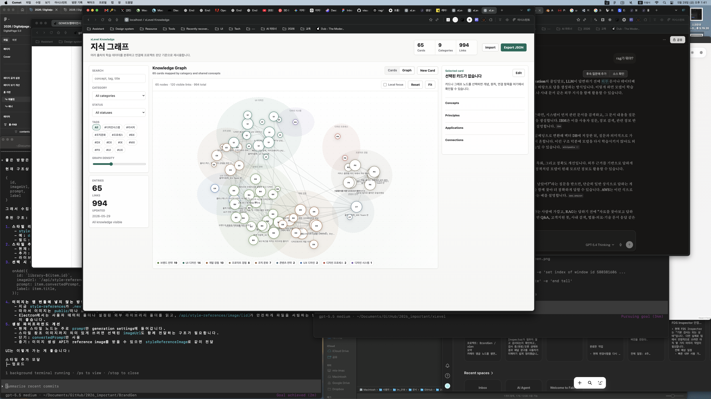

# Graph UI Improvement Completion Report

Date: 2026-05-29

## Summary

Improved the knowledge graph view so the initial graph screen fits the full node map into the visible canvas instead of showing only long crossing links. The graph now opens directly with `#graph`, uses a bounding-box camera fit, lowers default link density, and gives nodes, links, clusters, labels, hover, and selected states clearer visual hierarchy.

## Before

## After

## Changes

- Added graph camera state for nodes, bounds, first-fit, and fit invalidation.
- Replaced center-only graph reset with bounding-box fit-to-view.
- Reworked graph layout spacing so category clusters remain visible without pushing nodes far outside the canvas.
- Lowered default graph density from 180 to 120 visible links and changed the slider range to 40-280.
- Made links quieter by default and stronger only for selected/neighbor relationships.
- Reduced label noise by showing only important labels by default, with selected/hover/neighbor labels promoted.
- Added hover preview connection counts.
- Added `#graph` routing so the graph view can be opened and verified directly.
- Updated the workspace title and summary when switching between Cards and Graph.
- Polished graph background, clusters, controls, shadows, radius, and typography consistency.

## Verification

- `node --check knowledge/site/app.js` passed.
- `http://localhost:8080/knowledge/site/?v=graph-ui-2#graph` opens the graph view directly.
- The after screenshot shows the full graph visible inside the canvas.
- The graph summary shows `65 nodes · 120 visible links · 994 total`.
- Reset and Fit now use the same bounding-box fit logic.
- Filter, tag, local focus, graph tab entry, import, and save paths now invalidate graph fit when needed.

## Files Changed

- `knowledge/site/app.js`
- `knowledge/site/styles.css`
- `knowledge/site/index.html`
- `notes/graph-ui-improvement-plan.md`
- `notes/graph-ui-improvement-completion-report.md`
- `notes/screenshots/graph-ui-improvement-2026-05-29/before-fullscreen.png`
- `notes/screenshots/graph-ui-improvement-2026-05-29/after-fullscreen.png`

## Follow-Up

- Consider adding a mini-map or zoom level indicator if the graph grows beyond a few hundred nodes.
- Consider a dedicated local graph mode with animated re-layout around the selected node.

