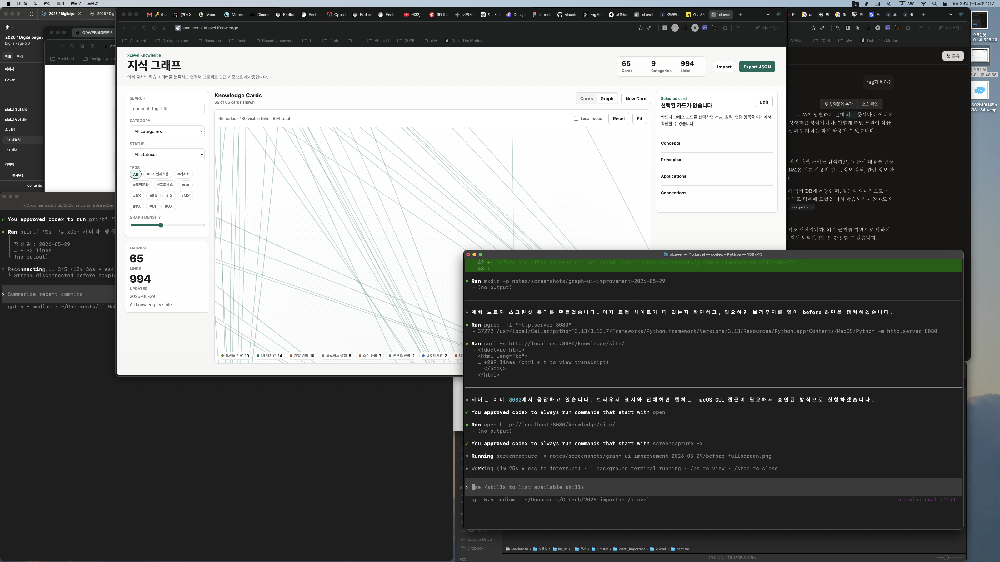

# Graph UI Improvement Plan

Date: 2026-05-29

## Goal

Improve the knowledge graph so the first graph view shows the full node structure instead of only long crossing links. The graph should feel like a usable knowledge exploration surface for multiple source types, not a source-specific Plus X archive.

## Before

## Current Findings

- `fitGraph()` only centers the viewport at `width / 2`, `height / 2` with `scale = 1`.
- `graphLayout()` spreads 65 nodes across a large category radius, so many nodes start outside the visible canvas.
- The default density shows many links at once, causing visual noise before the user understands the graph.
- Node, link, cluster, label, and focus states need clearer hierarchy.

## Reference Principles

- Cytoscape/Sigma-style graph viewers should fit the rendered node bounds into the camera on initial load.
- Obsidian-style graph exploration should distinguish overview from local focus.
- D3-style graph readability depends on controlling density, link strength, node collision, and grouping.
- Apple-style motion should clarify state changes without drawing attention to itself.

## Implementation Plan

1. Add persistent graph state for current nodes, links, bounds, and fit invalidation.
2. Replace center-only `fitGraph()` with bounding-box-based fit-to-view.
3. Trigger fit on first graph entry, Reset, Fit, filter changes, and local focus changes.
4. Lower the default link density and make non-focused links visually quieter.
5. Improve node/link/cluster layering, label visibility, hover preview, and focus contrast.
6. Polish typography, spacing, controls, graph background, and responsive behavior without changing the static app architecture.

## Verification

- Initial graph view shows the full node map.
- Reset and Fit restore a useful overview.
- Filtering and local focus reframe the visible graph.
- Hover and click still update preview/detail states.
- Before and after screenshots are saved under `notes/screenshots/graph-ui-improvement-2026-05-29/`.

