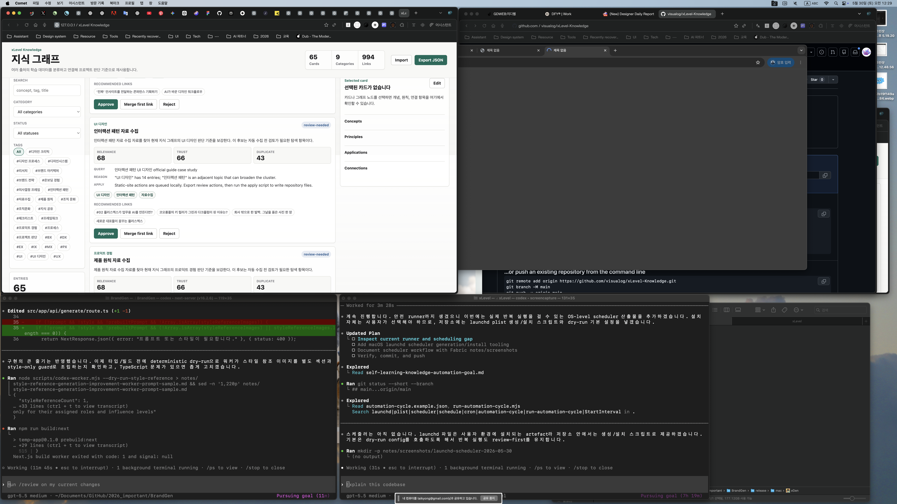
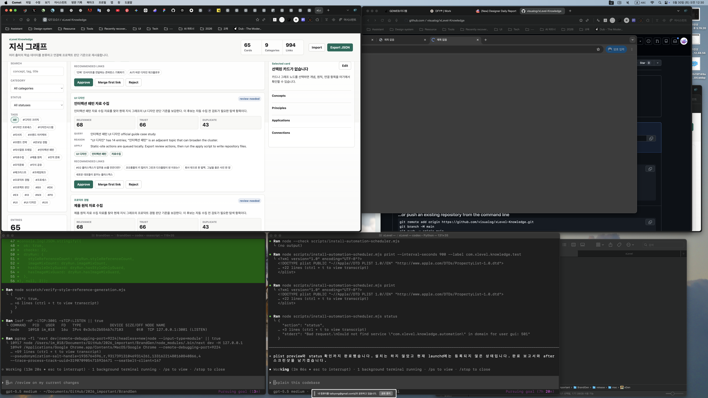

# Completion Report: launchd Scheduler

Date: 2026-05-30
Task: Add macOS launchd scheduler tooling for the self-learning automation cycle.

## Summary

Added `scripts/install-automation-scheduler.mjs`, which can print, install, uninstall, and inspect a macOS launchd LaunchAgent for the xLevel automation cycle.

The generated scheduler calls `scripts/run-automation-cycle.mjs --config knowledge/data/automation-cycle.example.json`, so the default scheduled behavior remains dry-run and review-first.

## Changes

- Added `scripts/install-automation-scheduler.mjs`.
- Added launchd actions:
  - `print`
  - `install`
  - `uninstall`
  - `status`
- Default schedule interval is six hours.
- Logs are directed to `logs/automation-cycle.out.log` and `logs/automation-cycle.err.log`.
- Updated goal documents with scheduler preview/install/status/uninstall commands.

## Before And After

### Before



### After



## Verification

Commands run:

```bash
node --check scripts/install-automation-scheduler.mjs
node scripts/install-automation-scheduler.mjs print
node scripts/install-automation-scheduler.mjs print --interval-seconds 900 --label com.xlevel.knowledge.test
node scripts/install-automation-scheduler.mjs status
```

Observed behavior:

- `print` emitted a valid LaunchAgent plist.
- The plist references `scripts/run-automation-cycle.mjs`.
- The plist uses `knowledge/data/automation-cycle.example.json`, which is dry-run by default.
- Custom label and interval were reflected in the printed plist.
- `status` reported that the scheduler is not currently installed.

## Known Limits

- `install` and `uninstall` intentionally modify user launchd state and were not run in this verification pass.
- The scheduled job still depends on the configured search provider or fixture.
- The automation remains review-first and does not approve candidates automatically.
