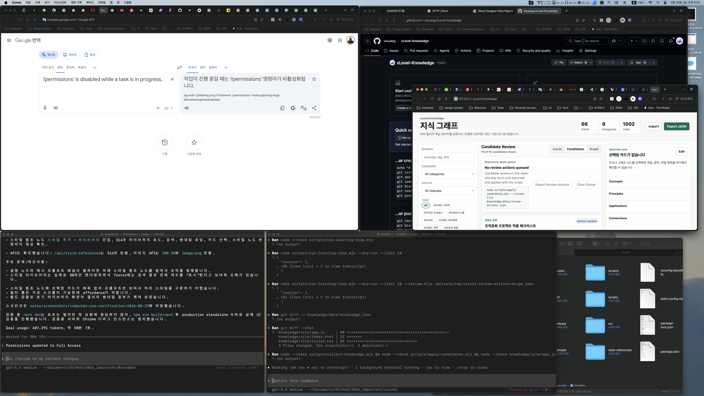

# Completion Report: Learning Loop Command

Date: 2026-05-29
Task: Add a repeatable command for the self-learning loop.

## Summary

Added `scripts/run-learning-loop.mjs` to orchestrate the review-first loop. The command collects candidates, optionally dry-runs exported review actions, rebuilds the normalized index, and emits a structured report.

## Changes

- Added `scripts/run-learning-loop.mjs`.
- The loop supports:
  - `--limit`
  - `--review-file`
  - `--dry-run`
  - `--skip-build`
- The loop does not auto-approve candidates. Review actions are applied only when a review file is provided, and the orchestrator uses dry-run apply mode.
- When a review file is provided, the loop dry-runs those actions before generating a fresh candidate set so exported actions still reference the current review queue.

## Before And After

### Before


### After



## Verification

Commands run:

```bash
node --check scripts/run-learning-loop.mjs
node scripts/run-learning-loop.mjs --dry-run --limit 10
node scripts/run-learning-loop.mjs --dry-run --limit 10 --review-file /private/tmp/xlevel-review-actions-merge.json
node --check scripts/collect-knowledge.mjs
node --check scripts/apply-candidates.mjs
node --check knowledge/site/app.js
git diff -- knowledge/data/knowledge.json
```

Results:

- Syntax checks passed.
- Dry-run loop generated 10 linked candidates.
- Dry-run loop with review file detected one review action and dry-ran a merge.
- Dry-run loop with review file applied the review-file step before collection.
- Index rebuild completed with no `knowledge/data/knowledge.json` diff.

## Known Limits

- Real external source discovery is still represented by generated discovery queries and deterministic candidates.
- Direct browser-to-repository writes are not implemented; the static export bridge remains the current review path.
