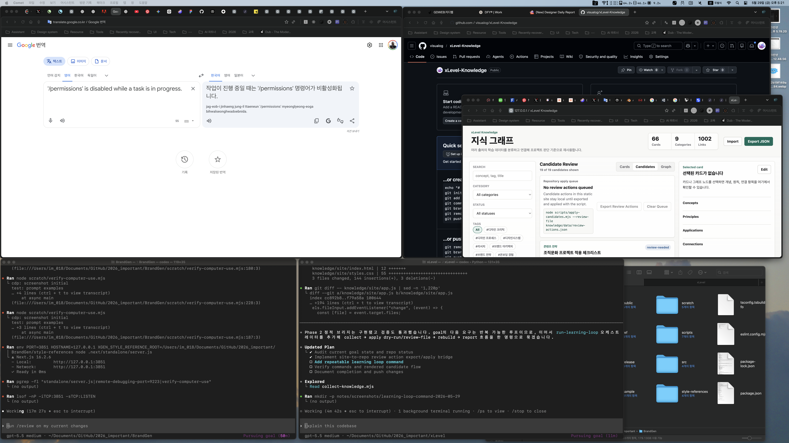

# Plan: Learning Loop Command

Date: 2026-05-29
Task: Add a repeatable command for the self-learning loop.

## Objective

Create one script that runs the current review-first learning cycle: collect candidates, optionally dry-run review actions, rebuild the index, and write a report.

## Current State

The repository has separate scripts for candidate collection, candidate application, and index rebuilding. The goal document calls for an optional `scripts/run-learning-loop.mjs` command to make the loop repeatable without auto-approving unverified sources.

## Plan

1. Add `scripts/run-learning-loop.mjs`.
2. Run collection with configurable `--limit`.
3. Run `scripts/apply-candidates.mjs --dry-run --review-file` when a review file is provided.
4. Run `scripts/build-knowledge-index.mjs`.
5. Write `knowledge/data/learning-loop-report.json`.

## Expected Change Areas

- `scripts/run-learning-loop.mjs`
- `knowledge/data/learning-loop-report.json`
- `notes/learning-loop-command-completion-report.md`

## Risks And Assumptions

- The loop remains review-first and does not approve candidates automatically.
- Review file application defaults to dry-run from this orchestrator.
- Real source discovery remains a later adapter step.

## Verification Plan

- `node --check scripts/run-learning-loop.mjs`
- `node scripts/run-learning-loop.mjs --dry-run --limit 10`
- `node scripts/run-learning-loop.mjs --dry-run --limit 10 --review-file /private/tmp/xlevel-review-actions-merge.json`

## Before Screenshots

