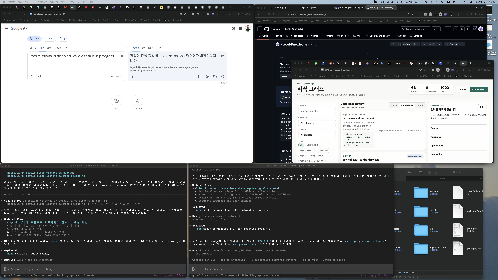
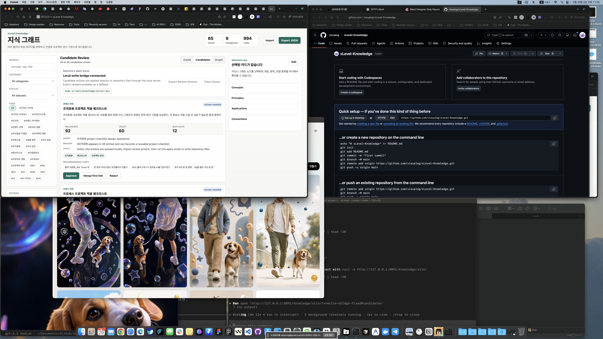

# Completion Report: Local Write Bridge

Date: 2026-05-29
Task: Add a local-only server bridge so reviewed candidates can be applied from the site to repository files.

## Summary

Added a local Node server that serves the knowledge site and exposes a local-only apply endpoint. When the site is opened through this server, candidate actions can be applied directly to repository files through `scripts/apply-candidates.mjs`; when the bridge is unavailable, the static export fallback remains active.

## Changes

- Added `scripts/knowledge-server.mjs`.
- Added `GET /api/health` for bridge detection.
- Added `POST /api/apply-review-actions` for applying review actions through the existing apply script.
- Updated the Candidates view to detect the bridge and show `Local write bridge connected`.
- Updated candidate actions so bridge mode applies repository writes directly, while static mode queues actions for export.
- Kept `Export Review Actions` available as fallback.

## Before And After

### Before



### After



## Verification

Commands run:

```bash
node --check scripts/knowledge-server.mjs
node --check knowledge/site/app.js
node --check scripts/apply-candidates.mjs
PORT=8091 node scripts/knowledge-server.mjs
curl -s http://127.0.0.1:8091/api/health
curl -s -X POST http://127.0.0.1:8091/api/apply-review-actions -H 'content-type: application/json' --data '{"dryRun":true,"actions":[{"action":"merge","candidateId":"candidate-조직문화-프로젝트-적용-체크리스트","into":"plusx-37-플엑-익힘책-mx-team-편"}]}'
curl -s http://127.0.0.1:8091/knowledge/site/
```

Results:

- Syntax checks passed.
- Health endpoint returned `ok: true` and `mode: local-write-bridge`.
- Dry-run apply endpoint invoked `scripts/apply-candidates.mjs` and returned a successful merge dry-run.
- The server now serves `/knowledge/site/` with `index.html`.
- Browser screenshot confirms the Candidates view shows `Local write bridge connected`.

## Known Limits

- The direct bridge was verified with dry-run apply to avoid mutating the current review queue during this pass.
- The server is intentionally local-only and binds to `127.0.0.1`.
