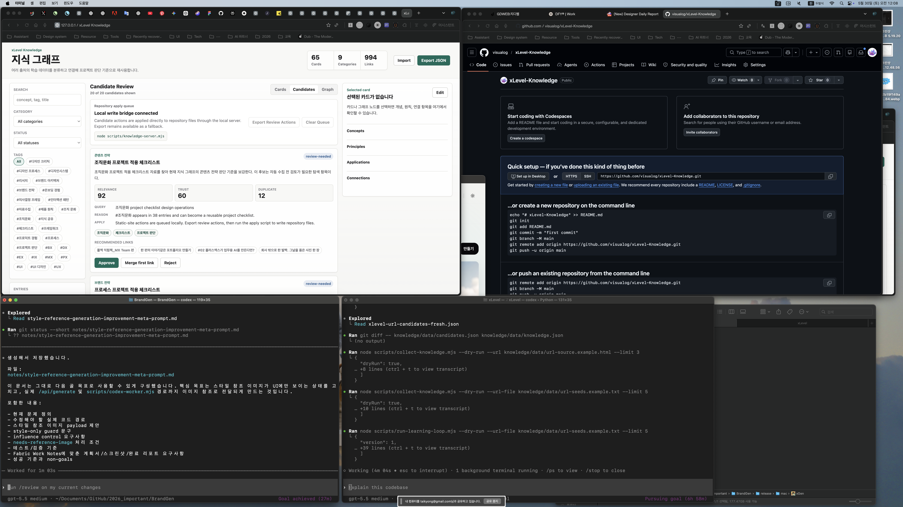

# Completion Report: Manual URL Adapter

Date: 2026-05-30
Task: Add manual URL input support to the review-first discovery pipeline.

## Summary

Added manual URL and URL-list ingestion to the self-learning pipeline. Operators can now provide `--url <path-or-url>` or `--url-file <path>`, and the collector extracts only HTML metadata into review-needed candidates.

The adapter keeps the pipeline copyright-safe by using title, canonical URL, site name, author, publication date, and meta description. It does not persist page bodies.

## Changes

- Added `--url` and `--url-file` to `scripts/collect-knowledge.mjs`.
- Added HTML metadata extraction for title, canonical URL, source name, author, publication date, and description.
- Added manual URL candidates with category inference, duplicate scoring, and links to existing entries.
- Passed URL options through `scripts/run-learning-loop.mjs`.
- Added deterministic fixtures:
  - `knowledge/data/url-source.example.html`
  - `knowledge/data/url-seeds.example.txt`
- Updated the goal documents to mark manual URL input as implemented.
- Switched collector and apply date stamping from UTC date slicing to local ISO date generation.

## Before And After

### Before


### After



## Verification

Commands run:

```bash
node --check scripts/collect-knowledge.mjs
node --check scripts/run-learning-loop.mjs
node --check scripts/apply-candidates.mjs
node scripts/collect-knowledge.mjs --dry-run --url-file knowledge/data/url-seeds.example.txt --limit 5
node scripts/collect-knowledge.mjs --dry-run --url knowledge/data/url-source.example.html --limit 3
node scripts/run-learning-loop.mjs --dry-run --url-file knowledge/data/url-seeds.example.txt --limit 5
node scripts/collect-knowledge.mjs --out /private/tmp/xlevel-url-candidates-fresh.json --url-file knowledge/data/url-seeds.example.txt --limit 1
```

Observed behavior:

- URL fixture produced a `manual-url` candidate.
- Candidate metadata included source URL, source name, author, publication date, summary, category, duplicate score, and existing-entry connections.
- Dry-run commands did not mutate `knowledge/data/candidates.json` or `knowledge/data/knowledge.json`.

## Known Limits

- Live remote URL fetching still depends on network access.
- The adapter extracts metadata only; richer source interpretation still requires review or a later browser/search integration.
- Search API or browser-backed discovery remains unfinished.
