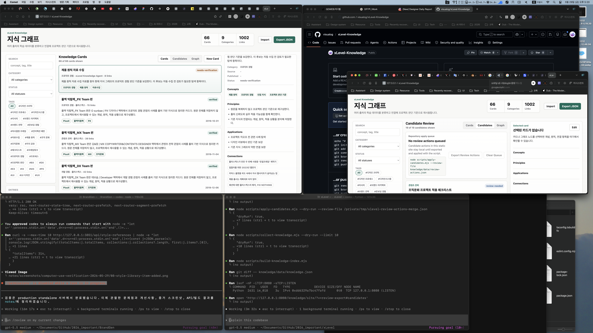

# Completion Report: Review Action Export

Date: 2026-05-29
Task: Implement Phase 2 static site-to-repo bridge from `docs/self-learning-knowledge-automation-goal.md`.

## Summary

Added an exportable review action queue to the static Candidates view. Candidate actions still update the browser-local review state immediately, but now they also queue repository apply actions that can be exported and passed to `scripts/apply-candidates.mjs --review-file`.

## Changes

- Added a `Repository apply queue` panel to the Candidates view.
- Added `Export Review Actions` and `Clear Queue` controls.
- Added localStorage-backed review action tracking.
- Queued actions include:
  - `approve` with `candidateId`
  - `reject` with `candidateId`
  - `merge` with `candidateId` and `into`
- Added UI copy explaining that static-site actions stay local until exported and applied.

## Before And After

### Before


### After



## Verification

Commands run:

```bash
node --check knowledge/site/app.js
node --check scripts/apply-candidates.mjs
node --check scripts/build-knowledge-index.mjs
node scripts/apply-candidates.mjs --dry-run --review-file /private/tmp/xlevel-review-actions-merge.json
node scripts/collect-knowledge.mjs --dry-run --limit 10
node scripts/build-knowledge-index.mjs
git diff -- knowledge/data/knowledge.json
```

Results:

- Site and script syntax checks passed.
- Review-file dry-run applied a merge action shape matching the new UI export format.
- Candidate generation dry-run returned 10 linked candidates.
- Index rebuild produced no `knowledge/data/knowledge.json` diff.
- The Candidates view rendered the repository apply queue panel in the browser.

## Known Limits

- This remains the static bridge path: exported JSON must still be passed to the apply script manually.
- A local write server can be added later if direct in-browser repository writes are desired.
