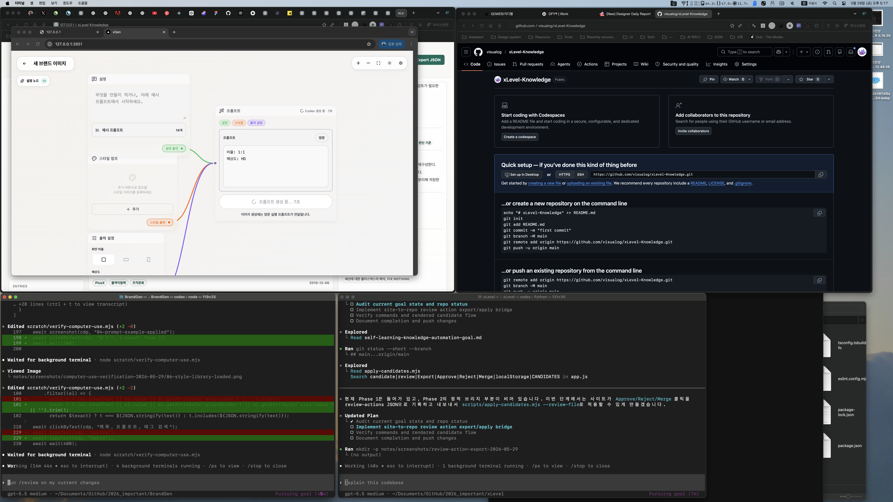

# Plan: Review Action Export

Date: 2026-05-29
Task: Implement Phase 2 static site-to-repo bridge from `docs/self-learning-knowledge-automation-goal.md`.

## Objective

Make candidate review actions in the static site exportable as JSON so they can be applied to repository files with `scripts/apply-candidates.mjs --review-file`.

## Current State

The site can approve, reject, and merge candidates in localStorage. The repository can apply review files via `scripts/apply-candidates.mjs`, but the site does not yet produce those review files.

## Plan

1. Track candidate review actions in localStorage.
2. Add visible action count and export controls to the Candidates view.
3. Make candidate cards explain that UI actions are local until exported and applied.
4. Export JSON in the shape accepted by `scripts/apply-candidates.mjs --review-file`.
5. Add a clear action queue button.

## Expected Change Areas

- `knowledge/site/index.html`
- `knowledge/site/app.js`
- `knowledge/site/styles.css`
- `notes/review-action-export-completion-report.md`

## Risks And Assumptions

- The site remains static, so it cannot write repository files directly.
- Exported review actions become durable only after running the apply script.
- Merge actions use the first recommended connection unless a later UI adds target selection.

## Verification Plan

- `node --check knowledge/site/app.js`
- Use a temporary review file with `scripts/apply-candidates.mjs --dry-run --review-file`.
- Open the Candidates route and capture after screenshot.

## Before Screenshots

