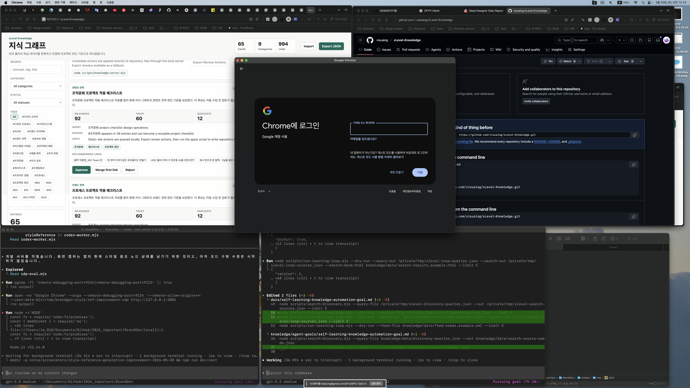

# Completion Report: Search Discovery Adapter

Date: 2026-05-30
Task: Convert exported discovery queries into review-first source URL candidates.

## Summary

Added `scripts/search-discovery.mjs`, a search discovery adapter that reads `discovery-queries.json` and writes curated-source compatible metadata seeds. The output can feed directly back into `scripts/collect-knowledge.mjs --source-file`, closing the path from generated query to source URL candidate without approving anything automatically.

The adapter stores only search result metadata: title, URL, host/source name, snippet, source query, rank, and connection context. It does not store article bodies.

## Changes

- Added `scripts/search-discovery.mjs`.
- Added deterministic fixture `knowledge/data/search-results.example.html`.
- Added optional `--search-out` and `--search-mock-html` to `scripts/run-learning-loop.mjs`.
- Updated goal documents with the query-to-source-seed workflow.
- Added warning output for search pages that return no parseable results.

## Before And After

### Before


### After



## Verification

Commands run:

```bash
node --check scripts/search-discovery.mjs
node --check scripts/run-learning-loop.mjs
node --check scripts/collect-knowledge.mjs
node scripts/collect-knowledge.mjs --dry-run --query-out /private/tmp/xlevel-discovery-queries.json --limit 5
node scripts/search-discovery.mjs --query-file /private/tmp/xlevel-discovery-queries.json --mock-html knowledge/data/search-results.example.html --out /private/tmp/xlevel-search-sources.json --limit 2
node scripts/collect-knowledge.mjs --dry-run --source-file /private/tmp/xlevel-search-sources.json --limit 5
node scripts/run-learning-loop.mjs --dry-run --query-out /private/tmp/xlevel-loop-queries.json --search-out /private/tmp/xlevel-loop-sources.json --search-mock-html knowledge/data/search-results.example.html --limit 5
```

Observed behavior:

- Query handoff produced five structured queries.
- Search discovery fixture produced one deduplicated source seed.
- The generated search source seed was accepted by `collect-knowledge --source-file`.
- Learning loop ran query export, search discovery, index build, and reported the search step.
- Dry-run commands did not mutate repository data files.

## Live Search Check

Command run:

```bash
node scripts/search-discovery.mjs --query-file /private/tmp/xlevel-discovery-queries.json --out /private/tmp/xlevel-live-search-sources.json --limit 1 --dry-run
```

The network request completed, but no parseable result was returned in this environment. The script reported `no-search-results-parsed`. Deterministic fixture coverage remains the stable verification path.

## Known Limits

- DuckDuckGo Lite can return challenge or non-result pages depending on network context.
- Dedicated search API support is still a future improvement.
- Human review remains required before source URLs are approved into durable knowledge.
