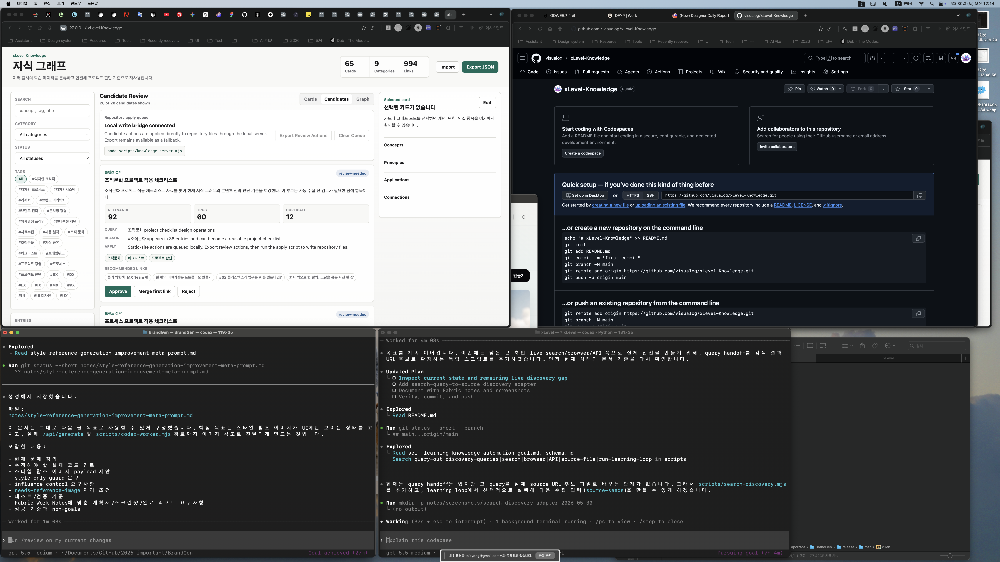

# Plan: Search Discovery Adapter

Date: 2026-05-30
Task: Convert exported discovery queries into review-first source URL candidates.

## Objective

Add a search discovery adapter that reads `discovery-queries.json`, resolves queries through a live search endpoint or deterministic fixture, and writes source metadata seeds that can feed back into `scripts/collect-knowledge.mjs --source-file`.

## Current State

The learning loop can export structured search queries with `--query-out`, but those queries still require a human or future adapter to find source URLs.

## Plan

1. Add `scripts/search-discovery.mjs`.
2. Read query handoff JSON from `--query-file`.
3. Fetch DuckDuckGo Lite HTML for live query resolution, with `--mock-html` for deterministic tests.
4. Parse only result metadata: title, URL, snippet, source host, and source query.
5. Write a curated-source compatible JSON file with `sources`.
6. Add optional `--search-out` and `--search-mock-html` pass-through to `scripts/run-learning-loop.mjs`.
7. Add a deterministic HTML fixture and update the goal documents.

## Expected Change Areas

- `scripts/search-discovery.mjs`
- `scripts/run-learning-loop.mjs`
- `knowledge/data/search-results.example.html`
- `docs/self-learning-knowledge-automation-goal.md`
- `knowledge/agent-goals/self-learning-knowledge-automation-goal.md`
- `notes/search-discovery-adapter-completion-report.md`

## Risks And Assumptions

- DuckDuckGo Lite HTML may change; the parser is best-effort.
- Live search requires network access and may fail in sandboxed runs.
- No article bodies should be stored, only search result metadata.

## Verification Plan

- `node --check scripts/search-discovery.mjs`
- `node scripts/search-discovery.mjs --query-file /private/tmp/xlevel-discovery-queries.json --mock-html knowledge/data/search-results.example.html --out /private/tmp/xlevel-search-sources.json --limit 2`
- `node scripts/collect-knowledge.mjs --dry-run --source-file /private/tmp/xlevel-search-sources.json --limit 5`
- `node scripts/run-learning-loop.mjs --dry-run --query-out /private/tmp/xlevel-loop-queries.json --search-out /private/tmp/xlevel-loop-sources.json --search-mock-html knowledge/data/search-results.example.html --limit 5`

## Before Screenshots

