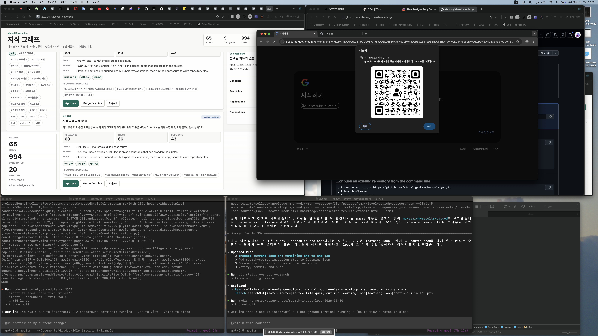
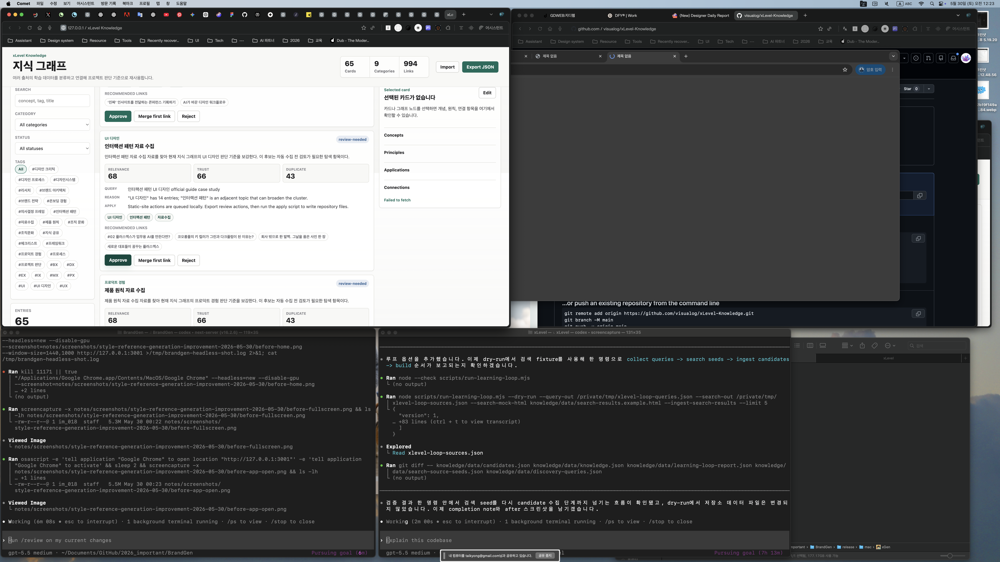

# Completion Report: Search Ingest Loop

Date: 2026-05-30
Task: Let the learning loop ingest search-discovered source seeds as candidates.

## Summary

Added `--ingest-search-results` to `scripts/run-learning-loop.mjs`. The learning loop can now run query generation, search metadata discovery, source-seed ingestion, index rebuild, and structured reporting in one command.

The flow remains review-first. Search results become candidate metadata only; no source is approved or written as durable knowledge without an explicit review action.

## Changes

- Added `--ingest-search-results` to `scripts/run-learning-loop.mjs`.
- The loop now runs `collect-knowledge --source-file <search-out>` after `search-discovery` when requested.
- Added `searchIngest` to the loop report.
- Updated goal documents with a single-command search-backed loop example.

## Before And After

### Before



### After



## Verification

Commands run:

```bash
node --check scripts/run-learning-loop.mjs
node scripts/run-learning-loop.mjs --dry-run --query-out /private/tmp/xlevel-loop-queries.json --search-out /private/tmp/xlevel-loop-sources.json --search-mock-html knowledge/data/search-results.example.html --ingest-search-results --limit 5
```

Observed behavior:

- Initial collect step exported five discovery queries.
- Search step wrote one deduplicated source seed to `/private/tmp/xlevel-loop-sources.json`.
- Search ingest step ran `collect-knowledge --source-file /private/tmp/xlevel-loop-sources.json`.
- Report included `searchIngest`.
- Dry-run did not mutate `knowledge/data/candidates.json`, `knowledge/data/knowledge.json`, `knowledge/data/learning-loop-report.json`, `knowledge/data/search-source-seeds.json`, or `knowledge/data/discovery-queries.json`.

## Known Limits

- Search provider quality still depends on available results or a dedicated provider.
- Approval is intentionally manual through candidate review actions.
- Non-dry-run search ingestion writes candidate queue data and should be run only when the operator is ready to refresh candidates.
