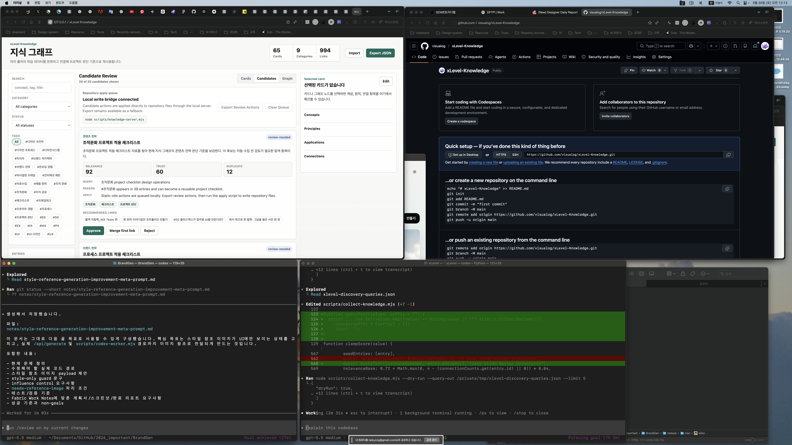

# Completion Report: Search Query Export

Date: 2026-05-30
Task: Export discovery search queries for human review and later search integration.

## Summary

Added `--query-out` to the collector and learning loop so generated discovery queries can be saved as a structured handoff file. This gives the self-learning loop a concrete bridge from internal gap detection to human search review or a future browser/search API adapter.

The query export does not approve candidates, fetch source bodies, or modify durable knowledge entries. It records review-ready query metadata and points the next step toward adding URLs through the existing URL/source/feed adapters.

## Changes

- Added `--query-out <path>` to `scripts/collect-knowledge.mjs`.
- Added query records with query text, candidate id, title, category, reason, kind, scores, connections, source URL, suggested next input, and review status.
- Added `--query-out <path>` pass-through to `scripts/run-learning-loop.mjs`.
- Filtered boilerplate concepts from generated search-query candidates.
- Avoided duplicated terms in weak-connection query strings.
- Updated the goal documents to mark search query output as implemented.

## Before And After

### Before


### After



## Verification

Commands run:

```bash
node --check scripts/collect-knowledge.mjs
node --check scripts/run-learning-loop.mjs
node scripts/collect-knowledge.mjs --dry-run --query-out /private/tmp/xlevel-discovery-queries.json --limit 5
node scripts/run-learning-loop.mjs --dry-run --query-out /private/tmp/xlevel-loop-queries.json --limit 5
```

Observed behavior:

- Collector wrote five structured query records to `/private/tmp/xlevel-discovery-queries.json`.
- Learning loop passed `--query-out` through and wrote `/private/tmp/xlevel-loop-queries.json`.
- Query output included `suggestedNextInput: search-query-then-add-url` for candidates without source URLs.
- Dry-run did not mutate `knowledge/data/candidates.json`, `knowledge/data/knowledge.json`, `knowledge/data/learning-loop-report.json`, or `knowledge/data/discovery-queries.json`.

## Known Limits

- This is a search handoff, not live search execution.
- Browser/search API integration remains unfinished.
- Human review is still required before adding source URLs or approving candidates.
