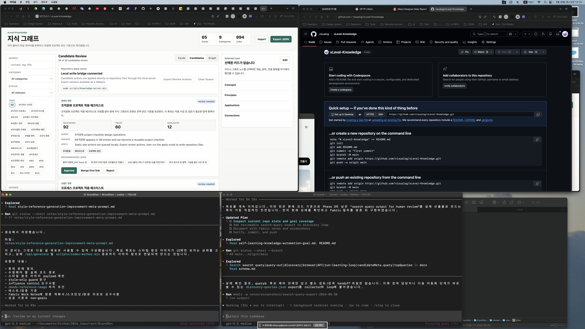

# Plan: Search Query Export

Date: 2026-05-30
Task: Export discovery search queries for human review and later search integration.

## Objective

Create a durable query handoff file from generated candidates so humans or later search/browser adapters can search, inspect, and feed URLs back into the review-first pipeline.

## Current State

Candidates already include `candidateMeta.query`, `candidateMeta.reason`, and recommended connections. The loop prints top queries, but it does not write a structured query list.

## Plan

1. Add `--query-out <path>` to `scripts/collect-knowledge.mjs`.
2. Export structured query records with query text, category, candidate id, reason, scores, connections, and suggested next input.
3. Add the same option to `scripts/run-learning-loop.mjs`.
4. Update the goal documents to mark search query output as implemented.
5. Verify dry-run behavior can still write the query handoff without mutating candidates.

## Expected Change Areas

- `scripts/collect-knowledge.mjs`
- `scripts/run-learning-loop.mjs`
- `docs/self-learning-knowledge-automation-goal.md`
- `knowledge/agent-goals/self-learning-knowledge-automation-goal.md`
- `notes/search-query-export-completion-report.md`

## Risks And Assumptions

- This does not perform live web search yet.
- Query export is safe to write in dry-run because it is an explicit handoff artifact, not an approval.
- The handoff should not store source article bodies.

## Verification Plan

- `node --check scripts/collect-knowledge.mjs`
- `node --check scripts/run-learning-loop.mjs`
- `node scripts/collect-knowledge.mjs --dry-run --query-out /private/tmp/xlevel-discovery-queries.json --limit 5`
- `node scripts/run-learning-loop.mjs --dry-run --query-out /private/tmp/xlevel-loop-queries.json --limit 5`

## Before Screenshots

