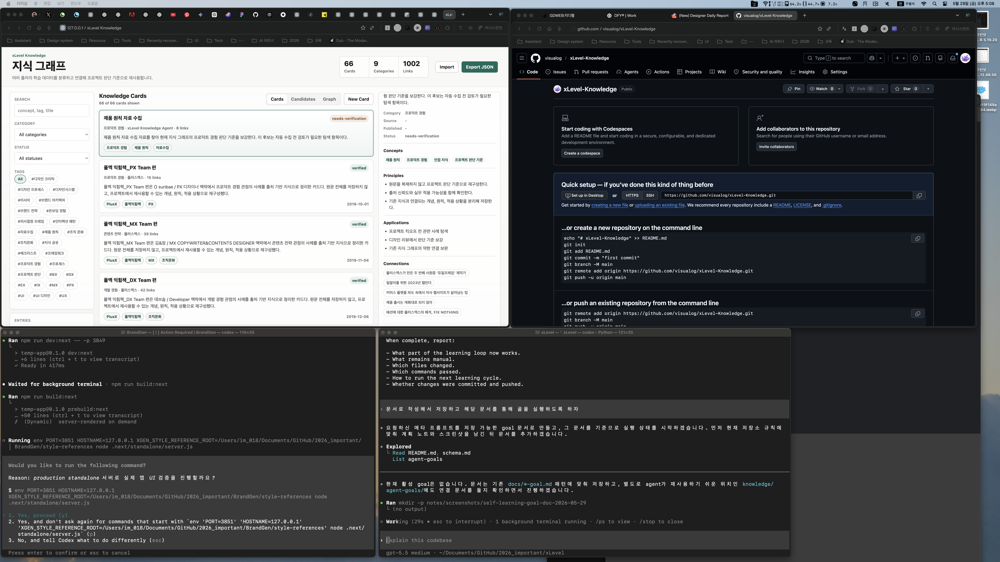
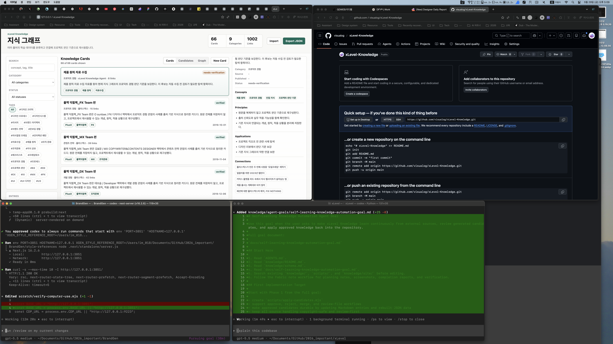

# Completion Report: Self-Learning Goal Document

Date: 2026-05-29
Task: Save the self-learning knowledge automation meta prompt as a reusable goal document and start execution from it.

## Summary

Created a durable goal document for the xLevel self-learning knowledge automation loop and added a short agent-goal entry that points future agents to the full implementation brief.

## Changes

- Added `docs/self-learning-knowledge-automation-goal.md`.
- Added `knowledge/agent-goals/self-learning-knowledge-automation-goal.md`.
- Added planning and completion notes for this documentation task.
- Captured before and after screenshots.

## Before And After

### Before

### After

## Verification

- Confirmed the repository knowledge overview and schema were read.
- Confirmed the new goal document and agent-goal entry were created.
- Confirmed there was no active goal before starting this one.

## Known Limits

- This task documents and starts the goal. The durable apply flow is the next implementation step.
