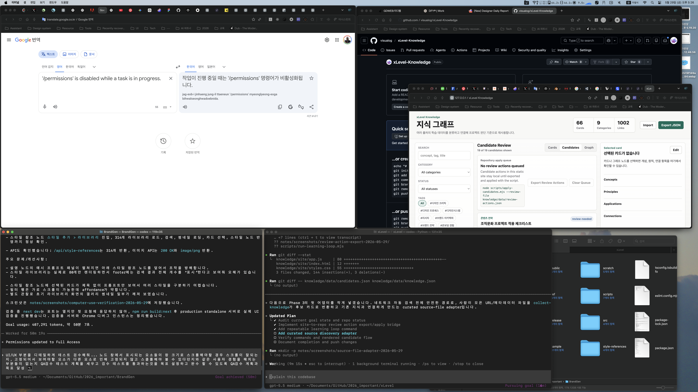
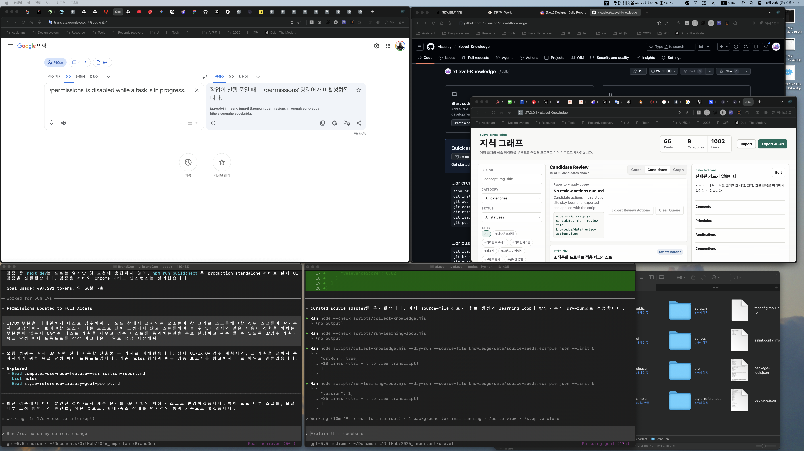

# Completion Report: Source File Adapter

Date: 2026-05-29
Task: Add the first real discovery adapter for curated external source metadata.

## Summary

Extended candidate collection so curated external source metadata can be converted into review-needed candidates. This gives the learning loop a safe source ingestion adapter before adding live web or RSS discovery.

## Changes

- Added `--source-file <path>` to `scripts/collect-knowledge.mjs`.
- Added curated source candidate conversion with source URL, source name, author, category, tags, summary, concepts, query, reason, trust score, relevance score, and recommended connections.
- Passed `--source-file` through `scripts/run-learning-loop.mjs`.
- Added `knowledge/data/source-seeds.example.json`.

## Before And After

### Before



### After



## Verification

Commands run:

```bash
node --check scripts/collect-knowledge.mjs
node --check scripts/run-learning-loop.mjs
node scripts/collect-knowledge.mjs --dry-run --source-file knowledge/data/source-seeds.example.json --limit 5
node scripts/run-learning-loop.mjs --dry-run --source-file knowledge/data/source-seeds.example.json --limit 5
```

Results:

- Syntax checks passed.
- Source-file dry-run generated 5 linked candidates.
- The curated source query appeared first: `Design Systems Handbook governance components`.
- The learning loop accepted `--source-file` and included it in the report.

## Known Limits

- The adapter uses provided metadata only; it does not fetch or parse external article bodies.
- Source-specific claims remain review-needed until verified against the original source.
